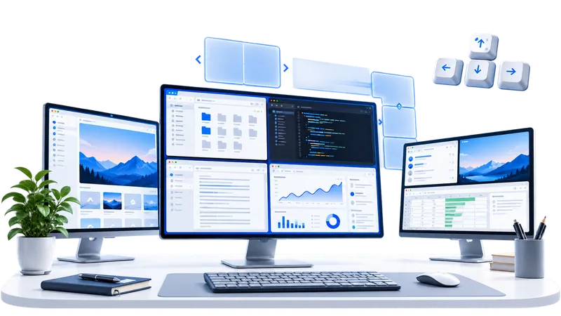

# Tessdeck for Windows

[English](README.md) | **한국어**

<p align="center">
  
</p>

단축키로 창을 화면 절반·사분면·3분할에 순식간에 붙여 주는 Windows 상주 프로그램.

> **v1.1.0 리브랜딩:** 기존 EbenTiler 사용자의 설정은 Tessdeck 첫 실행 시 자동으로 이전됩니다.

- 별도 런타임 설치 필요 없음 (Windows 11/10 에 기본 포함된 .NET Framework 4.8 사용)
- 실행 파일 하나, 약 100KB
- 알림 영역에 상주, 설정 창에서 단축키 자유롭게 변경
- 새 정식 버전이 있으면 최대 하루 한 번 알림으로 안내하며 자동 다운로드·설치는 하지 않음

[Privacy](PRIVACY.md) · [Security](SECURITY.md) · [Code signing policy](docs/CODE_SIGNING.md)

## 기본 단축키

| 단축키 | 하는 일 |
| --- | --- |
| `Ctrl + Alt + ←` | 왼쪽 절반 |
| `Ctrl + Alt + →` | 오른쪽 절반 |
| `Ctrl + Alt + ↑` | 위쪽 절반 |
| `Ctrl + Alt + ↓` | 아래쪽 절반 |
| `Ctrl + Alt + U` | 왼쪽 위 1/4 |
| `Ctrl + Alt + I` | 오른쪽 위 1/4 |
| `Ctrl + Alt + J` | 왼쪽 아래 1/4 |
| `Ctrl + Alt + K` | 오른쪽 아래 1/4 |
| `Ctrl + Alt + D` / `F` / `H` | 왼쪽 / 가운데 / 오른쪽 1/3 |
| `Ctrl + Alt + E` / `T` | 왼쪽 2/3 / 오른쪽 2/3 |
| `Ctrl + Alt + Enter` | 전체 화면(최대화) |
| `Ctrl + Alt + Shift + ↑` | 세로만 최대 (가로 폭 유지) |
| `Ctrl + Alt + C` | 화면 가운데로 |
| `Ctrl + Alt + =` / `-` | 크기 키우기 / 줄이기 |
| `Ctrl + Alt + Backspace` | 배치 전 원래 크기로 복원 |
| `Ctrl + Alt + Shift + →` / `←` | 다음 / 이전 모니터로 이동 |

`Ctrl + 방향키`를 쓰지 않는 이유: 거의 모든 텍스트 편집기와 브라우저에서 단어 단위 커서 이동에 쓰이는 조합이라,
전역 단축키로 뺏으면 타이핑이 망가진다. 설정 창에서 원하는 조합으로 바꿀 수 있다.

### 같은 키를 연달아 누르면 크기가 바뀐다

`Ctrl + Alt + ←` 같은 방향 단축키를 연달아 누르면 기본값으로 **50% → 33% → 67%** 순서로 크기가 바뀐다.
2초 안에 같은 창에서 같은 방향 키를 다시 누를 때만 순환하고, 그 뒤에는 첫 번째 비율부터 다시 시작한다.
`설정 > 레이아웃`에서 세 비율을 **20~80%** 범위로 직접 바꿀 수 있다. 예를 들어 `50 / 40 / 60`으로 설정하면 좌우 배치는 폭에, 위아래 배치는 높이에 같은 순서를 적용한다.

## 설치

일반 사용자는 `Tessdeck-Setup.exe`를 더블클릭하면 된다.
관리자 권한이 필요하지 않고 현재 사용자 계정에만 설치된다.

- 프로그램: `%LOCALAPPDATA%\Programs\Tessdeck\Tessdeck.exe`
- 시작 메뉴 바로 가기 등록
- 설치 화면에서 Windows 시작 시 자동 실행 여부 선택
- 설치 후 바로 실행 가능
- 제거: Windows **설정 > 앱 > 설치된 앱 > Tessdeck for Windows > 제거**

자세한 설치/인스톨러 빌드/코드 서명 안내는 [`INSTALL.md`](INSTALL.md)를 참고한다.

개발 중 직접 설치 스크립트를 써야 한다면 기존 PowerShell 방식도 사용할 수 있다.

```powershell
powershell -ExecutionPolicy Bypass -File install.ps1
powershell -ExecutionPolicy Bypass -File install.ps1 -Uninstall
```

설정까지 남기고 제거하려면 `-KeepConfig`, 자동 시작을 등록하지 않으려면 설치 시 `-NoStartup`을 붙인다.

## 빌드

.NET SDK 를 설치할 필요 없다. Windows 에 기본으로 들어 있는 .NET Framework 4.8 컴파일러로 바로 빌드한다.

```powershell
powershell -ExecutionPolicy Bypass -File build.ps1
```

결과물은 `build\Tessdeck.exe` 하나다. 원하는 곳에 두고 실행하면 된다.

정식 설치 프로그램은 다음 명령으로 만든다.

```powershell
powershell -ExecutionPolicy Bypass -File build-installer.ps1
```

결과물:

```text
dist\Tessdeck-Setup.exe
dist\Tessdeck-Setup.exe.sha256
```

## 실행

설치했다면 이미 실행 중이다. 설치 없이 그냥 써 보려면:

```powershell
build\Tessdeck.exe
```

알림 영역(작업표시줄 오른쪽)에 아이콘이 생긴다. **아이콘이 안 보이면 `∧` 를 눌러 숨김 목록을 확인**하면 된다.
Windows 는 처음 보는 프로그램의 아이콘을 기본으로 숨김 처리한다.

아이콘을 **왼쪽으로 누르든 오른쪽으로 누르든** 메뉴가 뜬다.

- `단축키 설정...` : 설정 창
- `Windows 시작할 때 함께 실행` : 자동 시작 등록/해제. 현재 켜져 있으면 앞에 체크 표시가 붙는다.
- `종료`

메뉴를 열 때마다 실제 등록 상태를 다시 읽어 체크를 맞추므로, 설정을 다른 데서 바꿔도 표시가 어긋나지 않는다.

### 처음 실행할 때

처음 사용하는 사람에게는 핵심 단축키를 설명하는 시작 가이드가 표시된다.
`다시 표시하지 않기`가 기본으로 선택되어 있어 보통 한 번만 나타난다. 체크를 풀고 닫으면 다음 실행 때 다시 볼 수 있다.

### 업데이트 확인

Tessdeck은 최대 24시간에 한 번 GitHub의 공개 최신 Release 정보를 확인한다.
현재 버전보다 새 정식 버전이 있으면 Windows 알림으로 한 번 알려 준다.

알림을 누르면 `설정 > 정보`가 열리며, 여기서 `업데이트 확인`을 직접 눌러 언제든 다시 확인할 수 있다.
업데이트 파일을 백그라운드에서 자동 다운로드하거나 자동 설치하지 않는다. 새 버전이 있으면 사용자가 직접 GitHub Release 페이지를 열어 확인한다.

## 명령줄에서 쓰기

스크립트나 다른 도구에서 창 배치를 시킬 수도 있다.

```powershell
Tessdeck.exe --apply LeftHalf                 # 지금 활성 창을 왼쪽 절반에
Tessdeck.exe --apply TopRight --hwnd 0x3B078E # 창을 직접 지정
Tessdeck.exe --info                           # 활성 창 위치와 화면 작업 영역 확인
Tessdeck.exe --list                           # 쓸 수 있는 명령 목록
Tessdeck.exe --settings                       # 설정 창만 열기
Tessdeck.exe --check                          # 단축키가 다른 프로그램과 겹치는지 확인
Tessdeck.exe --startup on|off|status          # 윈도우 시작 시 자동 실행 등록/해제/확인
Tessdeck.exe --out result.txt --info          # 결과를 파일로도 저장
```

`--check` 는 이런 식으로 알려 준다. 단축키가 안 먹을 때 제일 먼저 확인하면 된다.

```text
total=21
assigned=21
unassigned=0
failed=1
conflict=오른쪽 1/3 (Ctrl + Alt + H)
```

`Tessdeck.exe` 는 창 프로그램이라 표준 출력이 파이프로 잡히지 않을 때가 있다.
스크립트에서 결과를 읽어야 하면 `--out <파일>` 을 함께 쓰면 된다.

## 설정 창

알림 영역 아이콘을 눌러 `단축키 설정...` 을 고르면 열린다.

- 왼쪽 목록에서 기능을 고르고, 아래 입력칸에 원하는 키 조합을 **실제로 눌러** 지정한다.
- 오른쪽 **미리보기**에 고른 기능이 창을 화면 어디에 놓는지 그림으로 나온다.
  크기 조절이나 모니터 이동처럼 자리만으로 설명이 안 되는 것은 점선(바뀌기 전)과 화살표로 함께 보여 준다.
- 같은 조합을 이미 다른 기능이 쓰고 있으면 물어보고 그쪽을 비운다.
- 보조키(Ctrl/Alt/Shift/Win) 없는 조합은 막는다. 그렇게 등록하면 다른 프로그램에서 그 키를 아예 못 쓰게 된다.
- `레이아웃` 페이지에서 같은 방향 단축키를 반복할 때 사용할 세 가지 비율을 직접 지정할 수 있다.
- `정보` 페이지에서 현재 버전과 업데이트 상태를 확인할 수 있다.

## 아이콘

`assets\app.ico` 를 빌드 때 실행 파일에 박는다. 16 / 24 / 32 / 48 / 64 / 128 / 256 픽셀이 한 파일에 들어 있고,
**크기마다 따로 그렸다.** 큰 그림 하나를 줄여 쓰면 알림 영역(16픽셀)에서 뭉개지기 때문이다.

모양은 창 두 장이 겹친 것이다. 창을 정리하기 전 모습을 그대로 아이콘으로 삼았다.
색은 파랑과 흰색만 쓴다. 검정 테두리는 어두운 작업표시줄에서 배경에 묻혀 사라지기 때문이다.

```powershell
powershell -ExecutionPolicy Bypass -File tools\make-appicon.ps1   # 아이콘 다시 만들기
```

## 설정 파일

`%APPDATA%\Tessdeck\config.ini` 에 저장된다. 직접 편집해도 된다.

```ini
[Hotkeys]
LeftHalf=Ctrl+Alt+Left
TopLeft=Ctrl+Alt+U
Maximize=Ctrl+Alt+Enter

[Options]
Gap=0                  ; 창 사이와 화면 가장자리에 남길 여백(픽셀)
CycleHalves=true       ; 같은 방향 단축키 연타 시 아래 세 비율 순환
CycleRatio1=50         ; 첫 번째 비율(20~80)
CycleRatio2=33         ; 두 번째 비율(20~80)
CycleRatio3=67         ; 세 번째 비율(20~80)
ShowWelcomeGuide=false ; 다음 실행 때 시작 가이드를 표시할지 여부
```

값을 비워 두면 그 기능의 단축키는 등록하지 않는다.

업데이트 확인 상태는 별도 `%APPDATA%\Tessdeck\update-state.ini`에 마지막 확인 시각과 이미 알린 릴리스 태그만 저장한다.

## 개인정보 / Privacy

Tessdeck 앱은 개인정보, 사용 통계, 창 제목, 입력 내용이나 파일 내용을 수집하지 않으며 텔레메트리·광고·분석 SDK를 사용하지 않는다.

새 버전 알림을 위해 최대 24시간에 한 번 GitHub의 공개 Release API에서 최신 버전 정보만 확인한다. 앱은 업데이트 파일을 자동 다운로드하거나 자동 설치하지 않는다.

상세한 네트워크 동작과 로컬 저장 정보는 [`PRIVACY.md`](PRIVACY.md)를 참고한다.

## 검증

실제 창을 띄워 놓고 자동으로 확인하는 스크립트가 들어 있다.

```powershell
# 배치 계산이 실제 창 위치와 맞는지 (13가지 배치 + 최대화/복원/크기조절/가운데정렬)
powershell -ExecutionPolicy Bypass -File tools\verify.ps1

# 전역 단축키를 실제 키 입력으로 눌러 보고 확인
powershell -ExecutionPolicy Bypass -File tools\verify-hotkeys.ps1

# 설정 파일 반영, 여백, 세로만 최대, 모니터 이동, 중복 실행 방지, 자동 실행 등록
powershell -ExecutionPolicy Bypass -File tools\verify-more.ps1

# 설정 창을 실제 마우스 클릭과 키 입력으로 조작해서 저장까지 확인
powershell -ExecutionPolicy Bypass -File tools\verify-settings.ps1

# 레이아웃의 사용자 지정 순환 비율을 실제 UI로 저장해서 확인
powershell -ExecutionPolicy Bypass -File tools\verify-layout-settings.ps1

# 알림 영역 아이콘을 눌러 메뉴를 띄우고 체크 표시와 토글 동작 확인
powershell -ExecutionPolicy Bypass -File tools\verify-tray-menu.ps1

# 설정 창 미리보기가 기능마다 제대로 그려지는지 캡처
powershell -ExecutionPolicy Bypass -File tools\capture-preview.ps1

# 설정 창과 알림 영역 화면 캡처
powershell -ExecutionPolicy Bypass -File tools\capture-ui.ps1

# 창 두 개를 좌우로 붙인 화면 캡처
powershell -ExecutionPolicy Bypass -File tools\capture-demo.ps1
```

인스톨러 릴리스 검증:

```powershell
powershell -ExecutionPolicy Bypass -File tools\verify-installer.ps1
powershell -ExecutionPolicy Bypass -File tools\verify-release.ps1
```

실제 사용 중인 PC에서 업데이트 전후 설정/자동시작/설치 경로가 유지되는지 확인하려면:

```powershell
# 업데이트 설치 전에 한 번
powershell -ExecutionPolicy Bypass -File tools\verify-local-upgrade.ps1 -Mode Before

# 설정 > 정보 > 업데이트 확인 → 새 버전 설치 후
powershell -ExecutionPolicy Bypass -File tools\verify-local-upgrade.ps1 -Mode After
```

자동 검사는 버전, Tessdeck 설치 경로, 기존 EbenTiler 잔재, 자동시작 ON/OFF, 자동시작 실행 경로, config.ini의 기존 설정값을 비교한다. 마지막에는 사람이 설정 화면의 버전, 트레이 아이콘, 실제 단축키 동작 세 가지만 눈으로 확인하면 된다.

unsigned 공개 릴리스는 설치/제거와 SHA-256 검증을 통과한 뒤 게시한다. 코드서명 신원이 연결된 signed 릴리스는 Authenticode까지 추가 검증한다.

```powershell
powershell -ExecutionPolicy Bypass -File tools\verify-release.ps1 -RequireCodeSigning
```

## Code signing policy

SignPath Foundation 또는 다른 공개 코드서명 수단이 연결되기 전에는 검증된 unsigned GitHub Release를 공개할 수 있다. 이 경우 Release와 랜딩페이지에 코드서명 전 상태와 Windows의 `알 수 없는 게시자`/SmartScreen 경고 가능성을 명확히 표시한다.

코드서명 신원이 준비되면 이후 릴리스부터 Authenticode 서명과 Code Signing EKU 검증을 필수로 적용한다. 최초 공개 unsigned 버전이 `v1.0.0`이면 첫 signed 버전은 기존 사용자가 업데이트로 감지할 수 있도록 `v1.0.1` 이상을 사용한다.

SignPath Foundation은 공개 OSS 코드서명의 우선 검토 대상이지만 **현재 Tessdeck은 아직 SignPath 승인을 받거나 연동한 상태가 아니다.** 승인 전에는 SignPath가 현재 서명을 제공하는 것처럼 표시하지 않는다.

상세 정책과 공급자 선택 기준은 [`docs/CODE_SIGNING.md`](docs/CODE_SIGNING.md)를 참고한다.

## 알아 둘 점

- **관리자 권한으로 실행 중인 창은 옮길 수 없다.** Windows 가 낮은 권한 프로그램이 높은 권한 창을 조작하는 것을 막기 때문이다.
  그런 창까지 배치하려면 `Tessdeck.exe` 도 관리자 권한으로 실행해야 한다.
- 다른 프로그램이 이미 선점한 단축키는 등록에 실패한다. 이때는 시작 직후 알림으로 어떤 것이 실패했는지 알려 주고,
  `Tessdeck.exe --check` 로 언제든 다시 확인할 수 있다. 설정 창에서 다른 조합으로 바꾸면 된다.
  게임 런처나 독(dock) 프로그램이 `Ctrl+Alt+숫자`, `Ctrl+Alt+G` 같은 조합을 자주 가져간다.
- 창 위치는 DWM 이 알려 주는 **실제로 보이는 테두리** 기준으로 맞춘다. Windows 10/11 창 바깥의 투명한 여백만큼 어긋나 보이는 문제가 없다.
- 모니터마다 배율이 다른 환경을 위해 per-monitor DPI 인식으로 동작한다.

## 구조

| 파일 | 하는 일 |
| --- | --- |
| `src/Native.cs` | Win32 API 선언, DPI 인식 설정 |
| `src/SnapAction.cs` | 배치 명령 목록, 한국어 이름, 기본 단축키 |
| `src/Hotkey.cs` | 단축키 문자열 해석과 표시 |
| `src/Config.cs` | 설정 파일 읽기/쓰기 |
| `src/WindowManager.cs` | 창 찾기, 위치 계산, 이동, 원래 크기 기억 |
| `src/HotkeyManager.cs` | 전역 단축키 등록과 수신 |
| `src/TrayApp.cs` | 알림 영역 상주, 메뉴, 새 버전 알림 |
| `src/UpdateChecker.cs` | GitHub 공개 Release 버전 확인과 24시간 상태 기록 |
| `src/SettingsUpdateSection.cs` | 설정 > 정보의 수동 업데이트 확인 UI |
| `src/SettingsForm.cs` | 설정 창 |
| `src/Program.cs` | 진입점, 명령줄 모드 |
